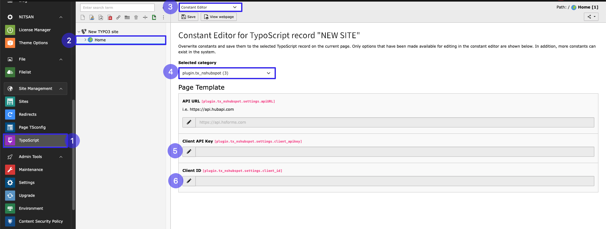
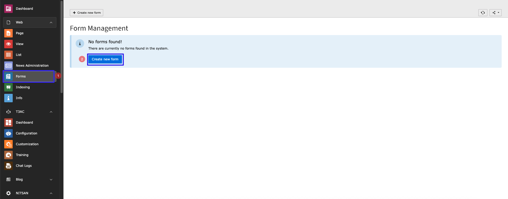
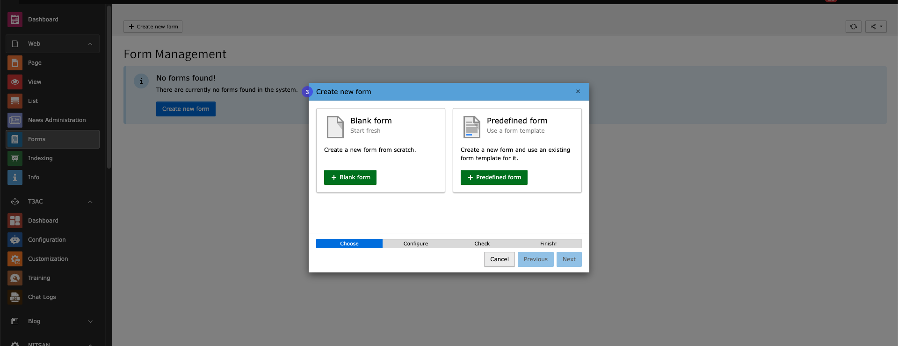
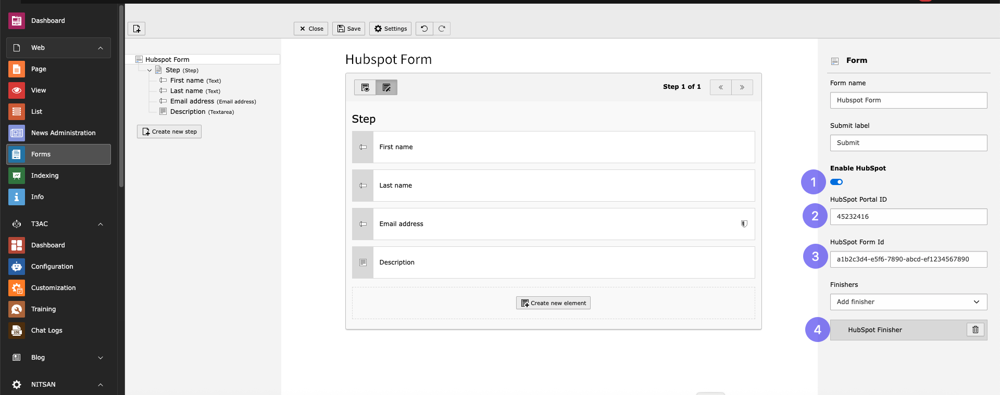
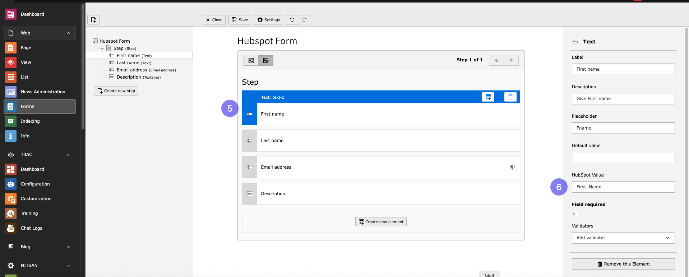
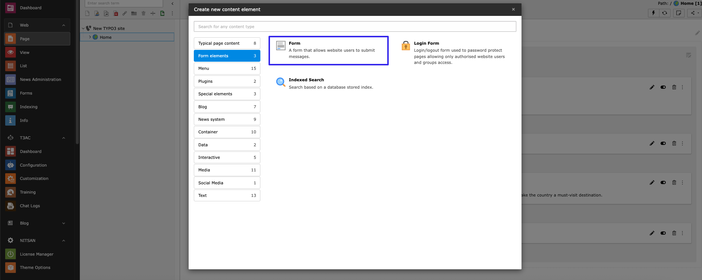
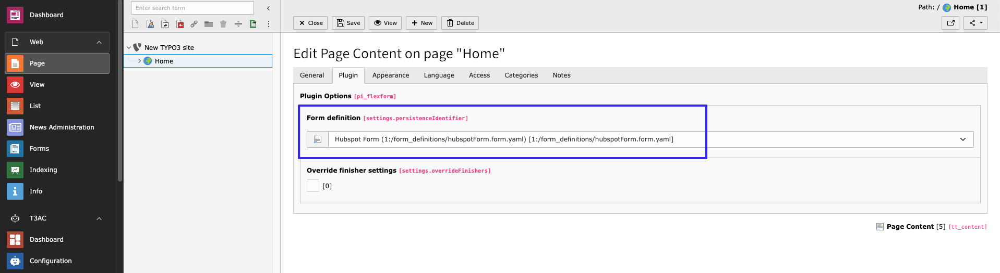

..  include:: /Includes.rst.txt

..  _configuration:

============================
Configuration - Free Version
============================

Please follow the steps below for configuration.

TYPO3 Configuration
===================

1. Go to TypoScript module.
2. Click on Root page.
3. Go to Constant editor.
4. Select ``plugin.tx_nshubspot``.
5. Add Client Id.
6. Add Client API.

To obtain the Client ID and Client API Key, please refer to the following links:

- `OAuth App Management <https://developers.hubspot.com/docs/reference/api/app-management/oauth>`_
- `Private Apps Overview <https://developers.hubspot.com/docs/guides/apps/private-apps/overview>`_

HubSpot Configuration
=====================

Please follow the steps below for HubSpot configuration.

Create a New Form
-----------------

1. Go to Form module.
2. Click on button "Create new".

3. Create Blank / Predefined Form.

Configure the Form
------------------

After adding the form, follow these steps:

1. Enable toggle HubSpot.
2. Add HubSpot Portal id.
3. Add HubSpot Form Id.
4. Select **HubSpot Finisher** from the dropdown.

5. Select Form Field.
6. Add HubSpot Value of Field from your HubSpot form.

**Repeat steps 5 and 6 for all fields you want to add in your form.**

To get form id, follow the steps shown in the link below:

https://knowledge.hubspot.com/forms/find-your-form-guid

Add the HubSpot Form Plugin
============================

To configure HubSpot Form in your site, please follow these steps:

1. Go to page.
2. Open Create Content element Wizard.
3. Go to Form Element tab.

4. Choose HubSpot Form from dropdown which you want to integrate.

Save configurations and use the plugin as per your requirements.
