..  include:: /Includes.rst.txt

..  _premium-configuration:

================================
Configuration - Premium Version
================================

Please follow the steps below for premium version configuration.

TYPO3 Configuration
===================

1. Go to Admin Tools Settings.
2. Click to Configuration extension.

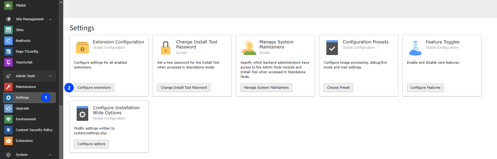

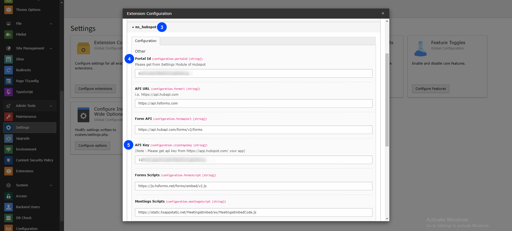

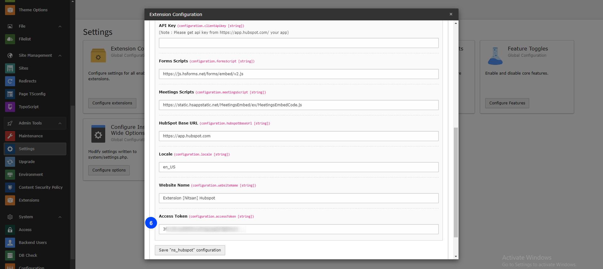

3. Click on ns_hubspot.
4. Add Portal Id.
5. Add API Key (Client Secret Key).
6. Add Access Token.

HubSpot Configuration
=====================

Please follow the steps below for HubSpot configuration.

Create HubSpot Account
----------------------

1. Create your new account in HubSpot: https://app.hubspot.com/
2. Click on setting icon, and go to Account Setup > Integration > Private Apps > click on Auth.

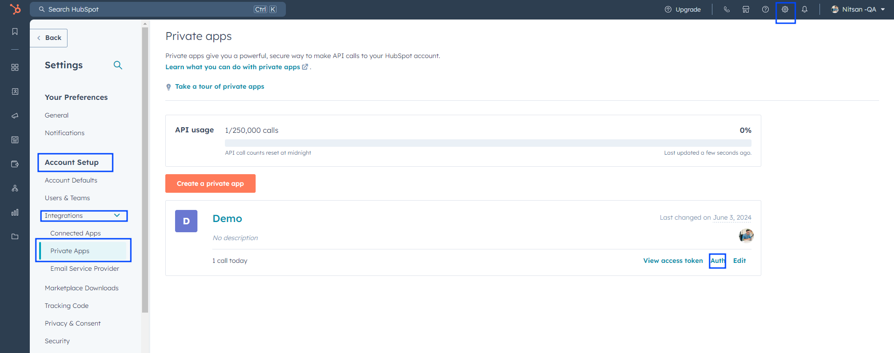

3. Get your "Portal Id", "API Key (Client secret)" and "Access token" from the Account setup.

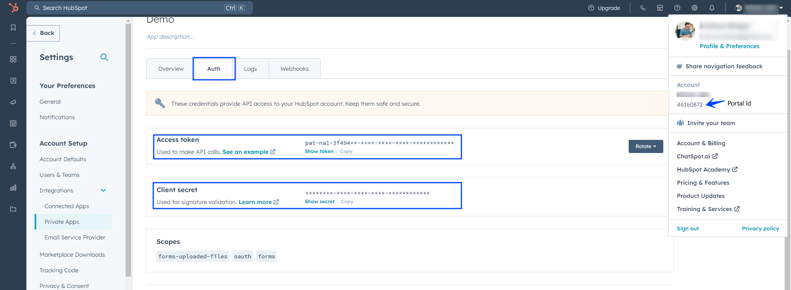

**Generate API Key (Client secret) and Access Token. Here is reference link for step by step guidance:** https://legacydocs.hubspot.com/docs/faq/how-do-i-create-an-app-in-hubspot

**After API Key, Portal Id and Access Token generation, configure it in settings.**

HubSpot Dashboard
=================

After all configuration, you can see backend different modules. Log into your HubSpot account from Dashboard.

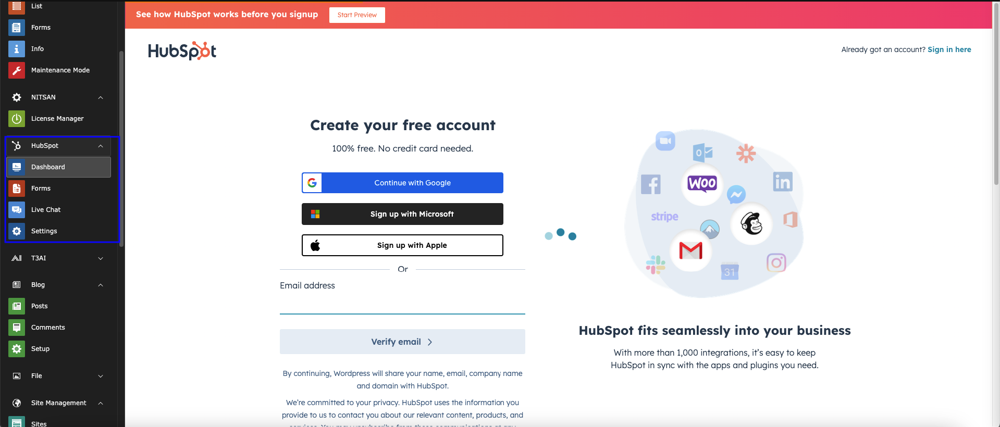

After login you can see all configurations of Live chat, Forms and Contacts.

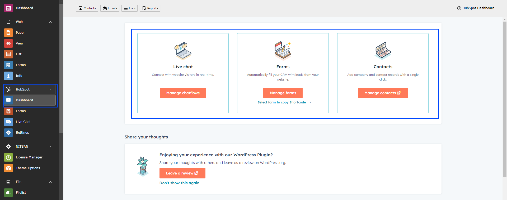

Create your HubSpot form
========================

Create your HubSpot form in forms module.

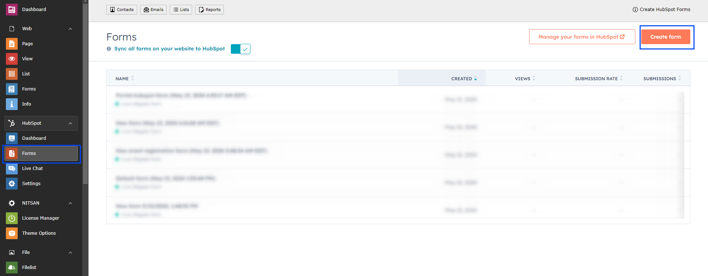

Create Website Chatflows in Live Chat
======================================

Go to HubSpot Live Chat module and click to create chatflow button.

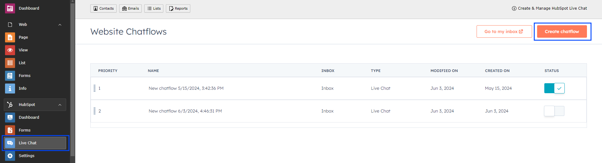

Add the HubSpot Form Plugin
============================

To configure HubSpot Form in your site, please follow these steps:

1. Go to page.
2. Open Create Content element Wizard.
3. Go to plugin tab add HubSpot form Plugin.

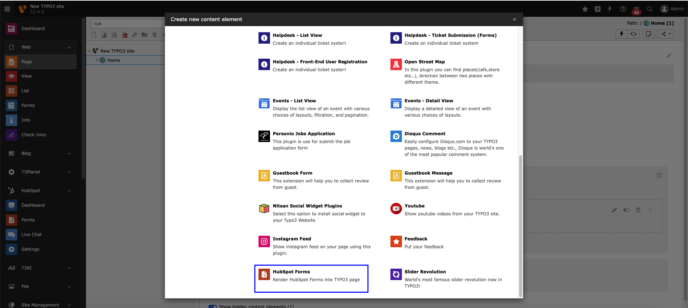

4. Choose HubSpot Form from dropdown which you want to integrate.

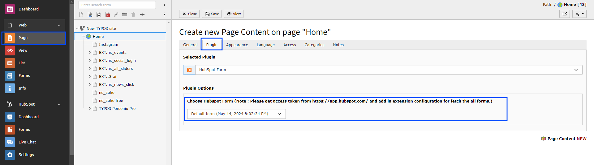

Save configurations and use plugin as per your requirements.
